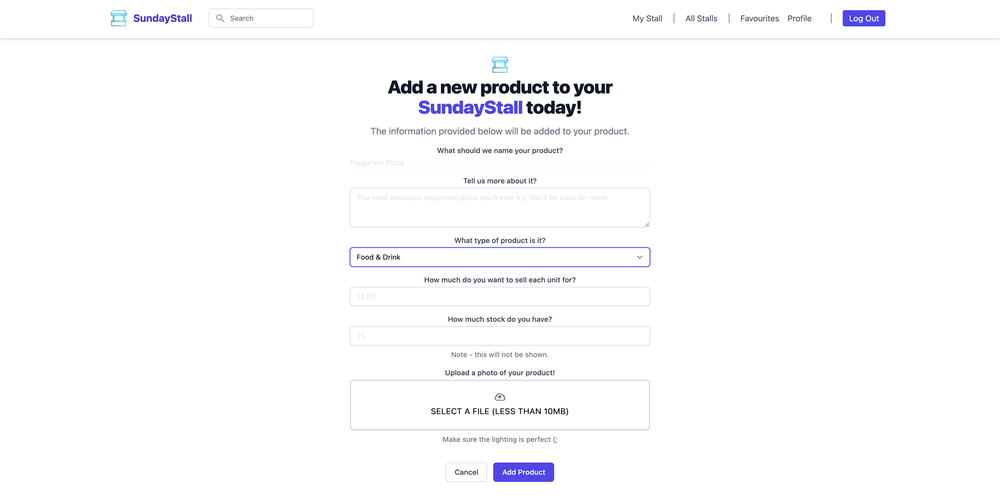

# T2A2 - Two-Sided Marketplace

### Coder Academy

### Sydney Fast-Track Bootcamp 2021

#### Garvey Chan

<hr>

# SundayStall

### Links (R9/R10)

[SundayStall](https://sundaystall.herokuapp.com)

[GitHub](https://github.com/garveychan/sunday-stall) / [Trello](https://trello.com/b/NpLIB3x5/t2a2-marketplace-project)

### The Market Problem (R7)

I believe that the long tail of the local consumer goods market (hobbyist bakers, weekend chefs, artisans, creators, and more) is underserved by existing marketplaces.


### Why is it a Problem that needs solving? (R8)

Markets across the world have benefited greatly from the advent of global communications and handheld devices. These advancements have spawned marketplace giants such as Etsy and eBay, who help match supply with demand and enable billions of dollars in transactions each year across various business categories. The growth of these marketplaces has democratised commerce, paving the way for consumers to become suppliers of underutilised assets (Airbnb), consumers to transact with businesses, and even for businesses to make deals with other businesses (Alibaba).

However, at a point in time when these marketplaces are largely saturated with established businesses and demand has been largely driven to the top of the food chain, it can be difficult for **sporadic suppliers** to **stand out** in the crowd. The requirements for maintaining a **brand presence** online can be far too **strenuous** for small business, with **recommendation algorithms** that favour more **consistent engagement**. In fact, businesses are recommended to respond to audiences within an hour of first engagement and usually have to share content on their platforms at least once a day _(Inside the Instagram Algorithm for 2021: How It Works and Where to Shift Your Strategy, 2021)_.

This has left a **fragmented** long-tail market of irregular merchants who have difficulty reaching their desired audience as well as an ensemble of buyers who like to discover niche items having to go the extra mile.

It should be noted that there is typically only one marketplace which gains a monopoly in its business vertical due to a phenomenon called 'network effects'. In effect, the more buyers there are on the platform, the more sellers will be attracted to it, and vice versa - helping to build a defensive moat that makes it very difficult for competing marketplaces to gain traction.

In order to compete against these marketplaces, one would have to provide a 10x better product or product experience, lower their take rate, or offer **unique inventory** to convince users to switch over (Tran, Webster and Wertz, 2021) - the latter of which this application hopes to achieve.

In summary -

- Niche businesses form a **fragmented** market.
- Small merchants encounter **high levels of friction** in managing their brand.
- Irregular transaction model faces **disadvantageous algorithms** on mature platforms.

### Description (R11)

#### Purpose

The purpose of this application is to provide a platform on which small businesses can cultivate an online presence with an intuitive interface and value-added workflow that doesn't carry the friction of having to multi-tenant across marketplaces and social media channels.

It is intended to aggregate a smaller number of **high-quality** merchants and provide them the tools to effectively cultivate their micro-brands.

#### Features

The features of the application include:

- **a Merchant Content Management System**
  - Create/Edit Forms for Merchant Stalls
  - Active/Inactive Status
  - Image Upload
  - Stall and Product Information Management
- **Search and Discovery Functions**
  - Custom search function based on Merchant-defined keywords
  - Stall and Product one-click wishlist
- **User Session Management**
  - Sign-Up/Sign-In/Edit for User Profiles
- **Administrator Dashboard**
  - All-inclusive Database Interrogation

Future iterations will have:

- Customer Relationship Management via In-App Messaging
- Online Transactions Pipelines with Payment Processing
- Merchant Smart Inventory Management
- Merchant Insights Dashboards
- Transactional Emails
- Fully Responsive Design

#### Sitemap


#### Screenshots

##### Landing Page - Title


##### Landing Page - Featured Stalls


##### Search Results


##### Sign Up Form


##### Sign In Form


##### Favourites (no favourites)


##### Stall Page


##### Stall Page - Products


##### Product Page


##### Favourites (existing favourites)


##### Stall Management


##### Stall Creation



##### Admin Dashboard


#### Target Audience

This marketplace is aimed at irregular merchants who want to reach an audience of niche explorer-consumers despite inventory scarcity and a smaller online footprint. Elegant aggregation of these suppliers will provide a meaningful user experience for potential buyers as well.

#### Tech Stack

- **Languages**

  - HTML5 - Website Markup
  - CSS3 - Website Styling
  - JavaScript - Website Styling
  - Ruby - Application Back-end

- **Ruby on Rails**

  - Server-side web application framework

- **PostgreSQL**

  - Relational Database Management System

- **Heroku**

  - Cloud Platform for hosting web applications

- **Amazon S3 (Simple Storage Service)**
  - Cloud Object Storage via a web service interface

<hr>

### The Development Process

#### Project Management (R20)

In developing this application, I will be splitting the project into several distinct stages as based on the **Agile** framework. By leveraging the Agile approach, I aim to stay **flexible** as I continue to **grow my knowledge** of the Ruby on Rails framework and **reflect** on what features are feasible to develop in a meaningful way as time progresses.

As this is a solo project, I must adhere to three of **Agile's core tenants**:

- **Short Development Cycles**

  - By breaking high level features down into their constituent **user stories**, I can begin to focus on small sections of the application at a time. This is fundamental to the Agile approach as it will allow me to **monitor my progress effectively** and to make more **accurate time estimates** for tasks in the backlog, not to mention the added benefit of making the overall task less daunting.

- **Embracing Change**

  - As **bugs** and more pressing **issues** inevitably make themselves known, I will have to either water down some **functions**, make compromises with other **features**, or swap out **planned tasks** for less time consuming ones. It is important that I lean into this and build on **user story by user story** so that I don't misallocate my time and end up with a half-baked product with defects and, more worryingly, **security vulnerabilities**.

- **Reflection**
  - I must take time to reflect after each **user story**, on both the work that I have completed as well as the **process** by which I completed it. This will help me identify ways to increase my productivity by making the right trade-offs and small-scale investments which might bear fruit later in the project - e.g. reconfiguring my VSCode extensions and installing development gems to assist with identifying issues, testing, scripting.

**Prioritisation**

In applying the Agile approach, I have prioritised my proposed features using the framework provided by the educators at Coder, splitting components into three categories:

- **Essential (Minimum Viable Product)**

  - User Session Management (Authentication/Authorisation)
  - Listings Platform (Stalls/Products, Users - Buyers/Sellers)
  - Seller Content Management System (Image Upload, Descriptions, etc.)

- **Desirable (Enhancements)**

  - Administrator Dashboard
  - Merchant Discovery via Search/Filter
  - Favourites
  - Reviews

- **Optional**
  - Transaction Handling (Buy and Sell)
  - Shopping Cart
  - Payment Processing
  - Google Maps Forms
  - Inventory Management
  - Customer Relationship Management - In-app Messaging
  - Seller Insights - Dashboard
  - Receipts and Insights - Transactional Emails

Note that these almost directly mirror the assignment's requirements by design.

**Kanban Board via Trello**

Key features/User stories will then be broken down into micro tasks (and bugs) and managed with a **Kanban Board** on **Trello**. I will follow the **convention** with columns representing a **Backlog**, **To Do** list, **In Progress** tasks, and **Completed** tasks.

**Post Mortem - Trello Board**


#### High-Level Abstractions (R15)

- **Users**
  - The application models **Users** as real people who wish to enter into the marketplace and transact with one another. As such, its attributes contain all the relevant information required for engaging with other buyers and sellers in an online environment - including minimally invasive **personal information** such as names and contact information.
- **Stalls**
  - The **Stalls** abstraction represents physical real-life market stalls as one might find on a Sunday morning at the farmer's markets. Stalls are set up with **cover photos, tag-lines, and descriptions** to pique people's interest as they wander around the marketplace (browsing the selections). The stalls are also assigned **keywords** so that people can quickly locate them if they know what they're after - akin to a real world directory.
- **Products**
  - **Products** form a child element of the **Stalls** abstraction, mirroring the individual goods and services that users/consumers might wish to purchase from the markets. These represent the **point of difference** between each market stall and are framed as such - with distinct names, prices and cover photos as well. Additionally, merchants are able to set stock levels so that their listings reflect their available inventory. Prices can be adjusted as well in order to meet fluctuating supply and demand across the market.
- **Favourites (Stalls and Products)**
  - **Favourites** are modelled to support consumer decision making processes, allowing **Users** to identify and store **Products** and **Stalls** of interest so that they may revisit at a later date if they are not yet ready to make a purchase, much like they would in the real world. These favourites are assigned to a **User** who must provide profile details so that their preferences can be persisted to the database and called upon in the future when required.

#### User Stories (R12)

As a **user**,
- I want to sign up with an account so that I can interact with others on the website.
- I want to be able to edit or delete my profile so that I can manage my presence on the website.

As a **seller**,
- I want to set up my stall so that other users can see my brand and what I'm offering.
- I want to add photos to my stalls and products to give a visual indication of my goods/services.
- I want to assign keywords to my stall so that users can find my products if they are relevant.
- I want to add products to my stall with details so that buyers can see what's available for purchase.
- I want to be able to edit my stall so that I can cultivate my brand effectively.
- I want to be able to edit my products so I change what's available to my buyers.
- I want to be able to delete my stall and/or products in the event that I no longer wish to transact.

As a **buyer**,
- I want to view all stalls and products on the platform so that I can see make informed purchase decisions.
- I want to search for stalls with keywords so that I can quickly find one that suits my needs.
- I want to add my favourite stalls and products to a wish-list so that I can come back to them in the future.

As an **administrator**,
- I want to have full access so that I can manage listings and moderate user behaviour on the platform.
- I want to view website statistics at a glance so I can make informed decisions about design.
- I want to interrogate the database so that I can make adjustments if necessary.
- I want to be able to assign different levels of website access to users so that I can delegate management duties.

#### Wireframes (R13)


#### Entity Relationship Diagram (R14)

Proposed Entity Relationship Diagram


Developed Entity Relationship Diagram


#### Database Relationships (R18)

In planning the database schema, additional features had been considered with tables created which didn't make it into the current iteration of the application. However, they will serve as a guide when I build upon this for further learning.

In developing the schema, I leveraged the main structural aspects of database design - **Keys** and **Relationships**. As such, the schema has been designed with one-to-one, one-to-many, and many-to-many relationships with ordinality and cardinality in mind to best represent the real-world entities being modelled.

As it stands, there are 5 distinct sections of the database, colour-coded to represent the 4 major **abstractions** mentioned above as well as the **ActiveStorage** component of the application (Attachments, Blobs, Variants).

- **Users**
  - The `users` table contains basic personal information related to each user, their login credentials (encrypted) and their role in the system.
  - An enumerated type has been defined to specify the roles to which any user can be assigned.
  - A user can have **one and only one** `stall`. This is in contrast to simply having **one** `stall` because a stall cannot belong to any other user. Only the user to which it was originally assigned.
  - A user can also have **zero or many** `favourites`, so that they are free to either not use the feature at all or 'favourite' every item to their heart's content.

- **Stalls**
  - Stalls contain declarative information such as their titles, tag-lines, descriptions, status, and association indicators.
  - Each stall has a **foreign key** which refers back to the `user` to which it belongs in a **one and only one** relationship.
  - Stalls also have a **one to many** relationship with `keywords` through its **join table** `keywords_stalls`. This is set up so that the search function can query stalls by their `keywords` in tandem.
  - This design is necessary because a `keyword` can **belong to many** stalls at a time but a stall can also have **zero or many** keywords simultaneously.
  - Each stall will also have an `image attachment` via ActiveStorage, with a **one to one** relationship. This is not **one and only one** because the image is interchangeable and can be swapped out for another one if the User decides they wish to update their stall.
  - A stall can have **zero or many** products in its scope - much like in a real world market.
  - Finally, a stall can belong to **zero or many** favourites - as the user decides whether or not they decide to 'favourite' that particular stall.

- **Products**

  - Products can belong to **one** `product category` at a time, defined when the product is created by the user. Conversely, each `product category` can have many different products.
  - Similar to `stalls`, each product can also have **one** image attached to it at a time. It can also belong to **zero or many** `favourites` generated by a `user` if that user has decided that like the product.
  - A **foreign key** helps attach each product to **one and only one** stall to which is has been assigned at creation.

- **Favourites**

  - Favourites records are largely **foreign key** records which connect the three major abstractions - `users`, `stalls`, and `products`. Each of the three tables can have or belong to **zero or many** favourites.
  - This flexibility allows the table to record **unique** instances of each `Favourite` generated by a `user`.

- **ActiveStorage**
  - ActiveStorage records reside within three separate tables joined with a **one and only one** relationship between each record.
  - As such, each record is transitively connected and can only relate to one another - this is important for ensuring that image integrity is preserved throughout the application.
  - The `blobs` table stores **metadata** and other relevant information to help the application retrieve the `image` when necessary.
  - The `attachments` table serves as a **join table** to allow any type of record to be connected to an `image blob`.
  - The `variant records` keeps track of the transformations performed on the original image stored.

It should be noted that **constraints** have been applied to each table to help protect the **integrity** of the database:

- Attribute **type** and **range** restrictions have been set to support **domain integrity**.
- Tables have been **normalised** to ensure that each entity is **unique** and less susceptible to **anomalies** such as malformed **updates**.
- Data must also be consistent throughout each table e.g. no **orphaned** records. Rails helpers such as **dependent destroy** have been employed to protect the **referential integrity** of the database.
- Future implementations of the application could leverage **business logic** to support **user-defined** integrity of the database e.g. `products` are automatically set to `inactive` if their `stock` reaches 0.

#### Rails Models (R17)

Each of the applications Models has been set up using standard Rails **convention** in order to take full advantage of all the **helper methods** provided by the framework - reducing bloat throughout the codebase and providing an efficient and elegant solution for effecting the **Model-View-Controller** model of Front-End/Back-End interaction.

As described in terms of their associations with one another:

**User**

```Ruby
  # Associations
  has_one :stall, dependent: :destroy
  has_many :favourites, dependent: :destroy

  # Delegations
  delegate :id, to: :stall, prefix: true, allow_nil: true # User.stall_id
```

- Each `User` has one `Stall`, a limit enforced to simplify the management of resources across the application at this stage.
- A `User` can have many different `Favourites` at a time, generated via the user interface with appropriate logic applied in the controller to verify which `Stall` or `Product` the `Favourite` will belong to.
- By applying the `dependent: :destroy` property, the `User` and its corresponding `Stall` and `Favourites` will be deleted all at once if desired.
- `User` has also delegated an `id` method to `Stall` which returns the id of the user's stall when queried.
- This attempts to conform with the **Law of Demeter**, a design guideline in Object-Oriented Programming which helps reduce class dependencies, enabling improved code reuse and easier maintainability.
- In this example, the `User` references its `Stall`'s id with `User.stall_id` rather than `User.stall.id`.
- `allow_nil` must be set to `true` so that an exception isn't thrown if the `User` doesn't currently own a `Stall`.

**Stall**

```Ruby
  # Associations
  belongs_to :user # Stall belongs to one user.
  has_one_attached :image # Blobs automatically purged if stall is destroyed.
  has_many :favourites, as: :favouriteable, dependent: :destroy # Destroy any favourite associations with users.
  has_many :products, inverse_of: :stall, dependent: :destroy # Destroy products associated with stall as well.
  has_and_belongs_to_many :keywords # Stall may have many keywords assigned to it. On delete, the keywords will remain but the join table records will be destroyed.
  accepts_nested_attributes_for :keywords, reject_if: ->(attributes) { attributes['term'].blank? } # Accepts keywords via Stall-based forms for persisting.

  # Delegations
  delegate :email, to: :user, prefix: true # Stall.user_email

  # Scope Extensions
  # Procure favourited stalls based on provided user (typically current_user via Devise)
  scope :favourites, lambda { |user|
    joins(:favourites)
      .where(favourites: { user_id: user.id })
  }
  # Procure search results based on HABTM relationship with keywords from search parameters
  scope :search_results, lambda { |keywords|
    joins(:keywords)
      .where(keywords: { term: keywords.downcase })
  }
```

- A `Stall` belongs to one and only one `User`. It will have one attached `Image` at a time, which is automatically purged if the `Stall` is deleted, thanks to ActiveStorage.
- The `Stall` can be `favouriteable`, via a **polymorphic** relationship set up on `Favourites` which allows both `Stalls` and `Products` to be favourited at the same time.
- A `Stall` also has many `Products` which will be destroyed if the `Stall is destroyed.
- Each `Product` is an **inverse** of `Stall` for **memory preservation** purposes.
- A **has and belongs to many** association has been established with `Keywords` via the `Keywords_stalls` table in order to correctly model the relationship with search parameters.
- Each `Keyword` can be assigned to many `Stalls` and each `Stall` can have many `Keywords`.
- If a `Stall` is deleted, then only the corresponding **join table** records will be deleted - not the `Keywords` which might still belong to other `Stalls`.
- Further, `Keywords` are a **nested attribute** for `Stalls` because they exist through an association rather than directly in the `Stalls` table.
- Similar to `User.stall_id`, the Law of Demeter is applied here to let a `Stall` reference its owner's `email` for contact purposes.
- **Scopes** have also been defined for `Stalls` so that they can quickly be queried and filtered as required. Typical use case is to identify a user's favourite stalls, or find stalls based on a keyword using the join table.

**Product**

```Ruby
  # Associations
  belongs_to :stall, inverse_of: :products
  belongs_to :product_category
  has_many :reviews
  has_many :users, through: :reviews
  has_one_attached :image # blobs automatically purged if product deleted
  has_many :favourites, as: :favouriteable, dependent: :destroy

    # Scope Extensions
  # Find favourited products based on User instance passed through as argument.
  scope :favourites, lambda { |user|
    joins(:favourites)
      .where(favourites: { user_id: user.id })
  }

  # Delegations
  delegate :id, to: :stall, prefix: true # Product.stall_id
  delegate :title, to: :stall, prefix: true # Product.stall_title
  delegate :user_email, to: :stall, prefix: true # Product.stall_user_email
```

- Each `Product` belongs to a `Stall`, leveraging the `inverse_of` method to help minimise **memory usage**.
- As described in the schema, a `Product` will belong to a particular `Product Category`. This is represented as an integer assigned to a `Product Category` id so that categories can be added in the future more easily.
- A `Product` can also have many `Reviews` - a simple feature for the next iteration.
- By association, a `Product` will also be connected to a `User` by the `Review` that a `User` might post.
- Like `Stalls`, each `Product` will have an associated `Image` and be `favouriteable` via a **polymorphic association**. The scope has also been extended to help controllers quickly retrieve (and **eager load**) a `User's` favourite `Products`.
- Further details have been delegated to `Stall` so that `Products` can render their `Stall's` information on their View.

**Keyword**

```Ruby
class Keyword < ApplicationRecord
  # Associations
  has_and_belongs_to_many :stalls, touch: true # touch - associated record's updated time is changed when keyword is change.
end
```

- Each `Keyword` exists in a **HABTM** relationship with `Stalls` as described above.
- The `touch` attribute has been applied so that if a keyword is updated, the associated `Stall` record has its **updated time** refreshed as well.

- **Favourite**

```Ruby
  # Associations
  belongs_to :user, foreign_key: :user_id
  belongs_to :favouriteable, polymorphic: true

  # Extend scope for filtering by specific object and/or user if they exist
  # Extend scope to filtering by type of Favourite - Stall or Product
  scope :for_user, -> (user) { where(user_id: user&.id) }
  scope :for_object, -> (object) { where(favouriteable_id: object&.id) }
  scope :stalls, -> { where(favouriteable_type: "Stall") }
  scope :products, -> { where(favouriteable_type: "Product") }
```
- `Favourites` exist in a **polymorphic** relationship with `favouriteable` items - `Stalls` and `Products`.
- They carry `favouriteable_type` and `favouriteable_id` attributes to help distinguish between different records of either a `Stall` or a `Product`.
- Further **scope extension** has been applied to help the `Favourites` controller quickly reference any particular record belonging to a `User` or to a `favouriteable` object.

#### Database Schema (R19)

```Ruby
# == Schema Information
#
# Table name: users
#
#  id                     :bigint           not null, primary key
#  date_of_birth          :date             not null
#  email                  :string           default(""), not null
#  encrypted_password     :string           default(""), not null
#  first_name             :string(50)       not null
#  last_name              :string(50)       not null
#  phone_number           :string(12)       not null
#  remember_created_at    :datetime
#  reset_password_sent_at :datetime
#  reset_password_token   :string
#  role                   :enum
#  created_at             :datetime         not null
#  updated_at             :datetime         not null
#
# Indexes
#
#  index_users_on_email                 (email) UNIQUE
#  index_users_on_reset_password_token  (reset_password_token) UNIQUE
#  index_users_on_role                  (role)
#
# Table name: stalls
#
#  id          :bigint           not null, primary key
#  active      :boolean          not null
#  description :text             not null
#  subtitle    :string(100)      not null
#  title       :string(50)       not null
#  created_at  :datetime         not null
#  updated_at  :datetime         not null
#  user_id     :bigint           not null
#
# Indexes
#
#  index_stalls_on_user_id  (user_id)
#
# Foreign Keys
#
#  fk_rails_...  (user_id => users.id)
#
# Table name: products
#
#  id                  :bigint           not null, primary key
#  active              :boolean          not null
#  description         :text             not null
#  name                :string(50)       not null
#  stock_level         :integer          not null
#  unit_price          :decimal(8, 2)    not null
#  created_at          :datetime         not null
#  updated_at          :datetime         not null
#  product_category_id :bigint           not null
#  stall_id            :bigint           not null
#
# Indexes
#
#  index_products_on_product_category_id  (product_category_id)
#  index_products_on_stall_id             (stall_id)
#
# Foreign Keys
#
#  fk_rails_...  (product_category_id => product_categories.id)
#  fk_rails_...  (stall_id => stalls.id)
#
# Table name: favourites
#
#  id                 :bigint           not null, primary key
#  favouriteable_type :string           not null
#  created_at         :datetime         not null
#  updated_at         :datetime         not null
#  favouriteable_id   :bigint           not null
#  user_id            :bigint           not null
#
# Indexes
#
#  index_favourites_on_favouriteable  (favouriteable_type,favouriteable_id)
#  index_favourites_on_user_id        (user_id)
#
# Foreign Keys
#
#  fk_rails_...  (user_id => users.id)
```

#### Third Party Services (R16)

Many third party services have been used in the **development** of the application and will be continued to use to support it in **production**. As with all third party services, these **dependencies** raise a risk to the livelihood of the application so it's generally best to rely on **tried and true** services with a strong reputation - preferably a well established organisation.

- **Hosting Services**

  - **GitHub** - A well established platform utilising the **distributed version control system**, **Git**. Hosted online and accessed via the **Command Line Interface**, this service allows developers - in my case, a developer - to push work to a remote location with comprehensive version control so that I can track each change in my application's source code down to the byte. This is critical for managing the development of an application with code spanning multiple files and folders where issues caused by the implementation or removal of a feature might not be known until several iterations down the track.
  - **Heroku** - Heroku provides a 'Platform as a Service (PaaS)', employing **containers** known as **Dynos** to allow developers to host applications on servers remotely with a relatively frictionless process. These **Dynos** are isolated from one another, even on the same machine, but can be called upon to support an application as it scales up.

- **Component Styling**

  - **TailwindCSS (ViewComponent, Stimulus)** - A utility-first **Cascading Style Sheets** framework which allows developers to rapidly build user interfaces right in the HTML code. Stimulus is a library which aims to support the front-end of the application with modest JavaScript enhancements.
  - **FontAwesome Icons**- Font Awesome specialises in **scalable vector** icons which can be plugged in to HTML with maximum customisability. It was originally an icon toolkit developed by Dave Grundy for use with another popular CSS framework Bootstrap.

- **Gems in Production**

  - **Devise** - Devise is one of the most popular **authentication** solutions for Ruby on Rails applications, coming built-in with modular components which handle almost all aspects of user authentication e.g. Database Persistence, User Confirmation, Password Recovery, Registration Management and Multi-Factor Authentication.
  - **CanCanCan** - CanCanCan is an **authorisation** library which makes it relatively intuitive to assign user privileges throughout an application. It allows developers to assign rules to certain roles and provides **Rails helpers** to reduce duplicated code throughout the MVC model.
  - **Rails Admin** - Rails Admin provides an easy-to-use interface for engaging with the database as a website administrator via the application directly.
  - The trifecta of the three gems above provides an efficient solution for authentication, authorisation and management of user access and information throughout the application.

- **Development Gems** -
  - **Rubocop** - A linter and formatter for helping to enforce best practice code styling.
  - **Bullet** - Scanner for N+1 queries in the application.
  - **Brakeman** - Scanner for security vulnerabilities.
  - **Annotate** - Annotates Model files with database schemas for quick reference.
  - **Letter Opener** - Spoofs emails in development environments for quick testing.
  - **Faker** - Generates fake data useful for database seeding.

<hr>

#### References

Shopify. 2021. Inside the Instagram Algorithm for 2021: How It Works and Where to Shift Your Strategy. [online] Available at: <https://www.shopify.com/blog/instagram-algorithm> [Accessed 20 May 2021].

Tran, A., Webster, M. and Wertz, B., 2021. Guide to Marketplaces. 3rd ed.

Photos from Unsplash
